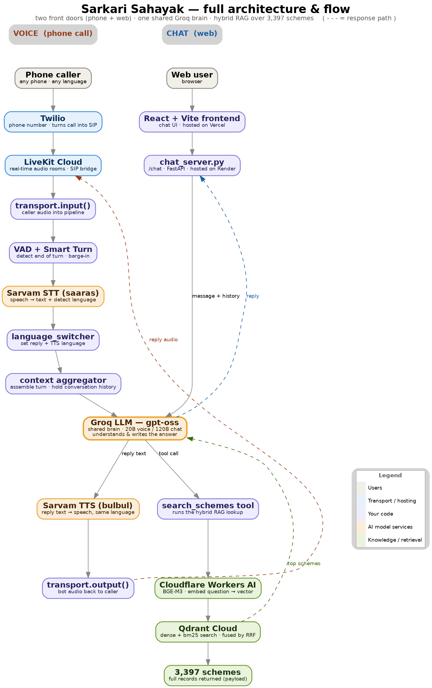
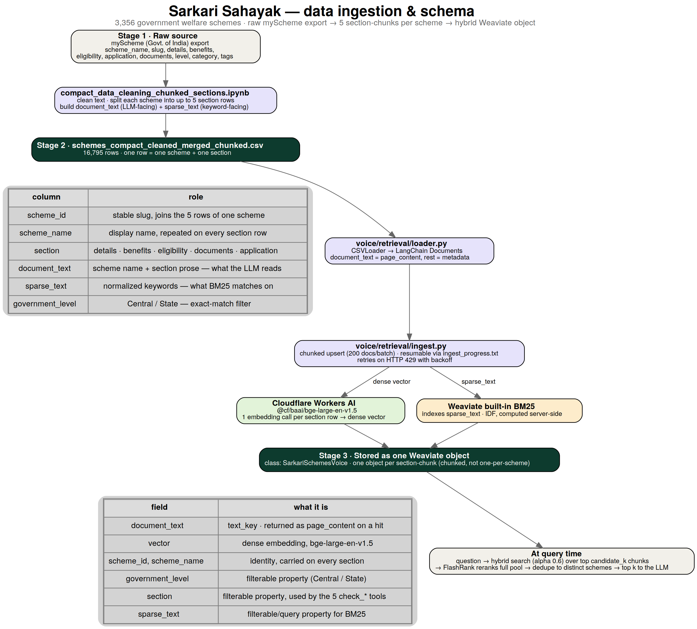

<div align="center">

# Sarkari Sahayak

**Government welfare schemes, one phone call away.**

A multilingual voice assistant that helps any citizen in India find the government welfare
schemes they actually qualify for — by calling a phone number and speaking naturally. No
smartphone, no internet, no reading required.

[](LICENSE)


<sub>Built for the Agent&#123;a&#125;thon hackathon · Open Innovation Track · by Team **The Debuggers**</sub>

</div>

---

## Table of Contents

- [Overview](#overview)
- [The Problem](#the-problem)
- [Key Features](#key-features)
- [Live Demo](#live-demo)
- [Architecture](#architecture)
- [How It Works](#how-it-works)
- [Data and Schema](#data-and-schema)
- [Tech Stack](#tech-stack)
- [Getting Started](#getting-started)
- [Project Structure](#project-structure)
- [Configuration](#configuration)
- [Evals](#evals)
- [Deployment](#deployment)
- [Limitations and Roadmap](#limitations-and-roadmap)
- [Team](#team)
- [License](#license)
- [Acknowledgements](#acknowledgements)

---

## Overview

India runs thousands of welfare schemes, but the people who need them most often cannot find or
claim them — the information sits behind text-heavy, mostly-English government portals that demand
strong reading and digital literacy.

**Sarkari Sahayak** removes that barrier entirely. It is a voice assistant you reach by calling a
regular phone number and talking in your own language — works on any phone, even a basic keypad
phone, with no internet or app.

The assistant is grounded in a knowledge base of **3,356 real government schemes**, split into
**16,795 section-level chunks** (details, benefits, eligibility, documents, application process).
Ask in plain language and it tells you what you qualify for, the benefits, the documents you need,
and how to apply — grounded in real scheme data, never invented.

> A web chat channel existed earlier in this project and is being rebuilt; it's rolling out again
> in a future release. For now, the phone line is the only front door — see
> [Limitations and Roadmap](#limitations-and-roadmap).

---

## The Problem

- Welfare information is scattered, mostly in English, and buried in complex web portals.
- Eligibility rules (age, income, occupation, category) are left for the citizen to decode alone.
- Confusion between National, State, and Regional schemes makes it worse.
- The intended beneficiaries are left behind — many pay middlemen to find their benefits, or give up.

---

## Key Features

- **Voice-first** — reachable by a plain phone call, no smartphone or app needed.
- **Grounded answers** — hybrid RAG over real scheme data; it will not invent schemes or amounts.
- **Scheme-aware follow-ups** — once a scheme is identified, dedicated tools answer eligibility,
  documents, benefits, application steps, or a general overview without losing context.
- **Query rewriting** — every tool call is translated to English and has its government-level /
  state filters extracted by a small, fast Groq pass before it reaches retrieval.
- **Broad coverage** — National, State, and Regional schemes (3,356 in the database).
- **Evaluated, not just demoed** — both retrieval and generation are scored against golden sets
  with ragas (see [Evals](#evals)).
- **Built on free / low-cost infrastructure** — self-hosted Weaviate in Docker, Cloudflare Workers
  AI embeddings, Groq inference.

---

## Live Demo

| Channel | Link |
| --- | --- |
| Voice helpline | Demo line available on request <sub>(currently a Twilio trial number)</sub> |
| Recorded demo | `voice/scheme-setu demo.mpeg` |
| Architecture walkthrough | `voice/sarkari-sahayak-voice-architecture.html` (open locally in a browser) |

---

## Architecture

One phone front door, a shared Groq brain, and a hybrid retrieval layer over 16,795 section-chunks.



- **Call path:** phone caller → Twilio (SIP) → LiveKit Cloud → the Pipecat bot (`voice/main.py`),
  which runs VAD and turn-taking, speech-to-text, the LLM, and text-to-speech.
- **Tools, not one search:** the LLM has six tools — `search_schemes` to discover schemes, and
  `check_eligibility` / `check_documents` / `check_benefits` / `check_application_process` /
  `check_scheme_details` to go deeper on one already-identified scheme.
- **Query rewriting:** before any tool call reaches retrieval, a small Groq pass
  (`voice/core/query_rewriter.py`) translates the caller's words to English and pulls out an
  explicit `government_level` / `state`, since the main LLM's phrasing doesn't reliably match the
  vector store's exact-match filters on its own.
- **Shared brain + retrieval:** each tool call embeds the question via Cloudflare Workers AI, runs
  a hybrid search in Weaviate, reranks the candidate pool with FlashRank, and returns the matching
  section-chunks.

---

## How It Works

**Real-time voice loop:** LiveKit moves the audio; Pipecat orchestrates the conversation. Audio
enters the pipeline, a VAD plus turn-detector decide when the caller has finished, speech is
transcribed by Sarvam STT, a welcome message plays, the LLM answers (calling one of the six scheme
tools when needed), and the reply is spoken back through Sarvam TTS and out via LiveKit. The
DTVR/IVR language menu (`voice/core/ivr.py`) exists in code but is currently disabled in the
pipeline — the assistant replies in Hindi only for now; see [Limitations and Roadmap](#limitations-and-roadmap).

**Tool calling:** the LLM never answers from its own memory about a specific scheme — it must call
a tool first. `search_schemes` discovers candidate schemes from a need described in the caller's
own words; once a scheme is identified (by name and `scheme_id`), the five `check_*` tools each
pull exactly one section of that scheme's record.

**Retrieval (hybrid RAG):** every tool query is rewritten to clean English with explicit filters,
matched two ways at once inside Weaviate — a dense vector (meaning) and BM25 over `sparse_text`
(keywords), fused with Weaviate's own hybrid scoring (alpha 0.6) — then the full candidate pool is
reranked by FlashRank and deduplicated down to distinct schemes before the LLM ever sees it.

---

## Data and Schema

3,356 raw schemes from myScheme are cleaned and split into up to 5 section-rows each (details,
benefits, eligibility, documents, application) — 16,795 rows total — then embedded and stored as
individual hybrid objects in Weaviate.



- **One scheme = up to 5 section-chunks**, so a hit on "eligibility" or "documents" comes back
  scoped to exactly that section, not the whole scheme dumped at once.
- **`document_text` feeds the LLM** (scheme name + section prose); **`sparse_text` feeds BM25**
  (normalized keywords); **`government_level` and `section` feed the filters**.
- **Hybrid vectors:** a dense vector from Cloudflare's `bge-large-en-v1.5` plus Weaviate's built-in
  BM25 over `sparse_text`, fused at query time (alpha 0.6).
- **Pipeline:** `data/compact_data_cleaning_chunked_sections.ipynb` (raw myScheme export → cleaned,
  chunked CSV) → `voice/retrieval/loader.py` (CSV → LangChain Documents) →
  `voice/retrieval/ingest.py` (embed + upsert, resumable, chunked in batches of 200).

---

## Tech Stack

| Layer | Technology |
| --- | --- |
| Telephony / transport | Twilio (phone → SIP), LiveKit Cloud (real-time audio, SIP bridge) |
| Voice orchestration | Pipecat (VAD, turn-taking, pipeline) |
| Speech | Sarvam AI — `saaras:v3` (STT) and `bulbul:v3-beta` (TTS) |
| LLM (conversation) | Groq — `openai/gpt-oss-20b`, low reasoning effort, Hindi-only replies |
| LLM (query rewriting) | Groq — `llama-3.1-8b-instant`, JSON-only, temperature 0 |
| Retrieval | Weaviate (self-hosted via Docker, hybrid dense + BM25) · FlashRank reranker
  (`ms-marco-MiniLM-L-12-v2`) · Cloudflare Workers AI — `bge-large-en-v1.5` embeddings |
| Evals | ragas (Faithfulness, Answer Relevancy, InstanceRubrics, AspectCritic, ToolCallAccuracy,
  RubricsScore) |
| Data pipeline | LangChain (`CSVLoader`, `langchain-weaviate`, `langchain-cloudflare`) |
| Hosting | LiveKit Cloud · self-hosted Weaviate (Docker) |
| Data source | myScheme (Government of India) |

---

## Getting Started

### Prerequisites

- Python 3.11+ and Docker (for self-hosted Weaviate)
- API keys / accounts for: **Groq**, **Sarvam AI**, **Cloudflare** (Workers AI), **LiveKit Cloud**,
  and **Twilio**

### 1. Clone

```bash
git clone https://github.com/Jagrit7/Sarkari-Sahayak.git
cd Sarkari-Sahayak
```

### 2. Backend setup

```bash
python -m venv .venv
source .venv/bin/activate          # Windows: .venv\Scripts\activate
pip install -r voice/requirements.txt
```

### 3. Environment variables

```bash
cp voice/.env.example voice/.env
# then open voice/.env and fill in your keys (see Configuration below)
```

### 4. Start Weaviate and ingest the scheme data

```bash
docker compose up -d weaviate
docker compose --profile tools run --rm ingest
```

The ingest step is resumable — `data/ingest_progress.txt` is bind-mounted so a rerun after a
failure or a rate limit picks up where it left off. Pass `--reset-progress` to start clean.

### 5. Run the voice agent

```bash
python -m voice.main
```

The bot connects out to LiveKit and joins the `support-room`; incoming phone calls (via
Twilio → SIP) are bridged into that room. To test locally without a phone call, generate a
join token with `python -m voice.generate_token` and connect a LiveKit-compatible client with it,
or run `python -m voice.voice_server` for a small FastAPI wrapper that also exposes `/token`.

---

## Project Structure

```
Sarkari-Sahayak/
├── docker-compose.yml                   # Self-hosted Weaviate + a one-off ingest service
├── LICENSE
├── voice/
│   ├── main.py                          # Voice agent entrypoint (Pipecat pipeline)
│   ├── voice_server.py                  # FastAPI wrapper — /token, /ws, /health
│   ├── generate_token.py                # Standalone LiveKit join-token generator (testing)
│   ├── requirements.txt                 # Full dependency set for the voice agent + evals
│   ├── .env.example                     # Template for the required keys
│   ├── scheme-setu demo.mpeg            # Voice agent demo recording
│   ├── sarkari-sahayak-voice-architecture.html   # Standalone architecture walkthrough page
│   ├── to-be-fixed-added.txt            # Running engineering backlog
│   ├── core/
│   │   ├── pipeline.py                  # Assembles the Pipecat pipeline
│   │   ├── ivr.py                       # DTMF language-lock gate (currently disabled) + WelcomeMessage
│   │   ├── languages.py                 # Single source of truth for the IVR language menu
│   │   ├── prompt.py                    # System prompt (Hindi-only agent)
│   │   ├── query_rewriter.py            # Translates + extracts filters before every tool call
│   │   ├── tool.py                      # The 6 scheme tools exposed to the LLM
│   │   ├── transport.py                 # LiveKit transport setup
│   │   └── config.py                    # Settings loaded from environment
│   ├── services/
│   │   ├── stt.py                       # Sarvam speech-to-text
│   │   ├── tts.py                       # Sarvam text-to-speech
│   │   └── llm.py                       # Groq gpt-oss-20b
│   ├── retrieval/
│   │   ├── loader.py                    # CSV -> LangChain Documents
│   │   ├── embeddings.py                # Cloudflare Workers AI embeddings
│   │   ├── vectorstore.py               # Weaviate connection + LangChain vector store
│   │   ├── reranker.py                  # FlashRank reranking
│   │   ├── retriever.py                 # search_schemes + the 5 check_* section lookups
│   │   ├── ingest.py                    # Resumable, chunked embed + upsert
│   │   └── Dockerfile                   # Image used by the docker-compose `ingest` service
│   └── eval/
│       ├── retrieval-evals/             # Precision/Recall/NDCG/MRR against a golden query set
│       └── generation-evals/            # ragas-scored generation quality against a golden set
├── data/
│   ├── compact_data_cleaning_chunked_sections.ipynb   # Raw myScheme export -> cleaned, chunked CSV
│   ├── schemes_compact_cleaned_merged_chunked.csv     # 16,795 section-chunks, ready to ingest
│   └── ingest_progress.txt              # Resume checkpoint (bind-mounted into the ingest container)
└── docs/                                # Architecture and schema diagrams
```

---

## Configuration

Set these in `voice/.env` (see `voice/.env.example`):

| Variable | Used for |
| --- | --- |
| `LIVEKIT_API_KEY` | LiveKit Cloud authentication |
| `LIVEKIT_API_SECRET` | LiveKit Cloud authentication |
| `LIVEKIT_URL` | LiveKit project URL (`wss://...livekit.cloud`) |
| `GROQ_API_KEY` | Groq LLM (conversation + query rewriting) |
| `SARVAM_API_KEY` | Sarvam speech (STT / TTS) |
| `CLOUDFLARE_ACCOUNT_ID` | Cloudflare Workers AI (embeddings) |
| `CLOUDFLARE_API_TOKEN` | Cloudflare Workers AI authentication |
| `WEAVIATE_HOST` | Weaviate host — set to `weaviate` automatically inside docker-compose |

---

## Evals

Both retrieval and generation are scored against golden sets, not just eyeballed from a demo call.

**Retrieval** (`voice/eval/retrieval-evals/`, 10-query golden set, k=3):

| Precision@k | Recall@k | R-Precision | MRR | NDCG@k |
| --- | --- | --- | --- | --- |
| 0.57 | 0.88 | 0.83 | 0.95 | 0.88 |

**Generation** (`voice/eval/generation-evals/`, ragas-scored against a multi-turn golden set):

| Faithfulness | Answer Relevancy | Correctness | Natural Spoken Tone |
| --- | --- | --- | --- |
| 0.75 | 0.77 | 2.7 / 3 | 0.88 |

Latency is tracked alongside every run (embed + search, rerank, and full generation turns) so
retrieval and reply quality never get evaluated without their cost. Re-run either suite with
`python evaluate_retrieval.py` or `python evaluate_generation.py` from inside the corresponding
`voice/eval/*-evals/` folder.

---

## Deployment

- **Voice agent:** runs as a long-lived worker that dials out to LiveKit, so it needs an always-on
  host (for example a free-tier VM) — or run it from your machine during demos.
- **Vector DB:** Weaviate runs self-hosted via `docker-compose.yml` (no managed Weaviate Cloud
  dependency); persisted to a named volume so re-ingesting isn't required on every restart.
- **Embeddings:** Cloudflare Workers AI has a free tier.

---

## Limitations and Roadmap

**Current limitations**

- The DTMF language-menu IVR (`voice/core/ivr.py`) is implemented but currently disabled — the
  assistant replies in Hindi only for every call, regardless of the language the caller speaks.
- The web chat channel from an earlier version of this project is being rebuilt and isn't part of
  this release.
- The scheme data is a one-time snapshot; incremental refresh isn't wired up yet.
- No memory across calls; the current telephony setup handles one caller at a time (demo scale),
  and everyone joins the same `support-room` unless that's changed per deployment.

**Roadmap** (tracked in `voice/to-be-fixed-added.txt`)

- Bring the multilingual IVR language-lock back online.
- Rebuild and re-launch the web chat channel.
- Full observability / logging, and offline evals wired into CI.
- Supabase as a unified user/state layer; WhatsApp integration; proactive alerts.
- Caching, latency work, and support for concurrent/parallel calls beyond one caller at a time.
- Context and prompt compression for longer conversations.

---

## Team

**The Debuggers** — built for the Agent&#123;a&#125;thon hackathon (Open Innovation Track).

- Jagrit Goel — Team Lead
- Parth Krishan Goswami
- Milind Suman
- Soahum Trivedi

---

## License

Released under the [MIT License](LICENSE).

---

## Acknowledgements

- Scheme data from [myScheme](https://www.myscheme.gov.in/) (Government of India).
- Built with [Pipecat](https://www.pipecat.ai/), [LiveKit](https://livekit.io/),
  [Sarvam AI](https://www.sarvam.ai/), [Groq](https://groq.com/), [Weaviate](https://weaviate.io/),
  [FlashRank](https://github.com/PrithivirajDamodaran/FlashRank), and
  [Cloudflare Workers AI](https://developers.cloudflare.com/workers-ai/).
